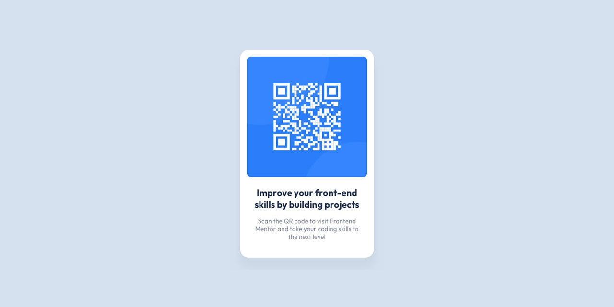

# Frontend Mentor - qr-code-component-solution

## Table of contents

- [Overview](#overview)
- [Screenshot](#screenshot)
- [Links](#links)

## Overview

### The challenge

Users should be able to:

- View the optimal layout depending on their device's screen size
- See hover states for interactive elements

### Screenshot

### Links

- Live Site URL: [View The Live Project](https://devukay.github.io/qr-code-challange/)

- Frontend Mentor: [View my solution at FrontEnd Mentors](https://www.frontendmentor.io/solutions/responsive-css-grid-adSd6VgSts)

## Author

- Twitter - [@kingkayyy](https://twitter.com/kingkayyy)
